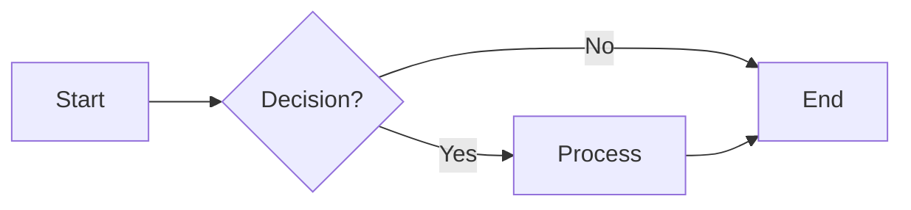

# Henry's Project

## Maybe using HTML, or JS, web

- HTML
- JS
- Python
- TypeScript
- Java
- Web Server

---

### Mermaid


```mermaid
flowchart LR
    A[Start] --> B{Decision?}
    B -->|Yes| C[Process]
    B -->|No| D[End]
    C --> D
```

### Python

```python
print("Hello World")
```
